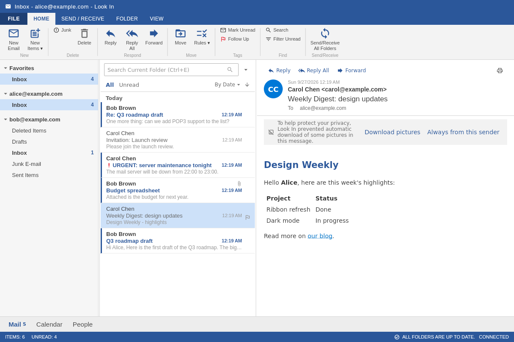
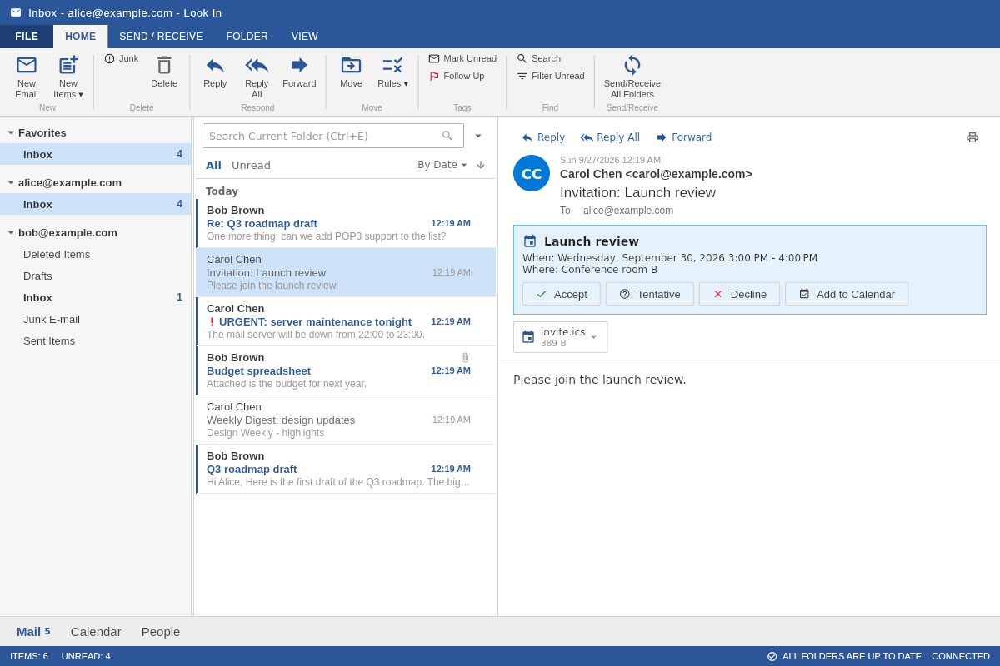
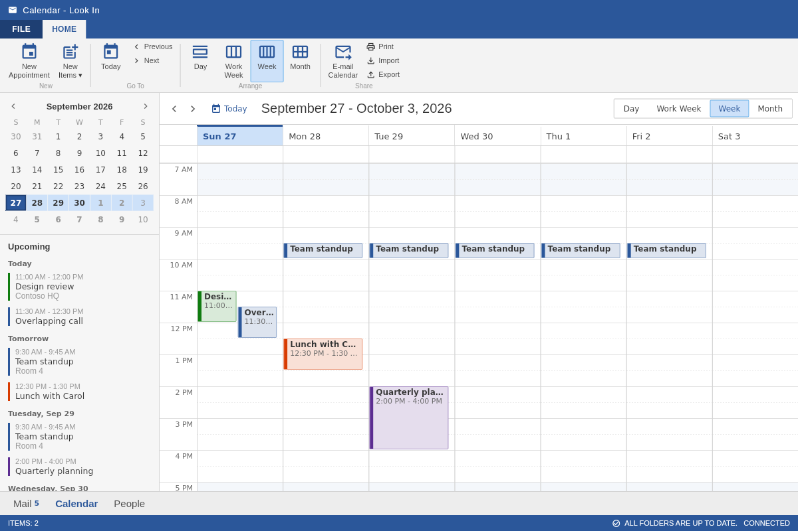
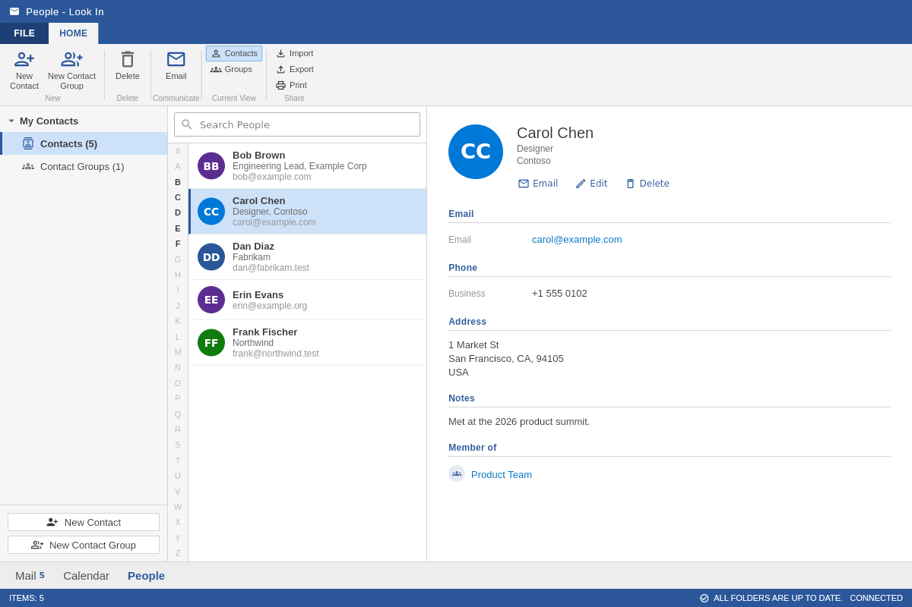

# Look In

A Linux desktop email client, calendar and address book inspired by
Microsoft Outlook 2013, built with Flutter.




| Meeting invitations | Calendar | People |
|---|---|---|
|  |  |  |

## Features

**Mail**
- IMAP and POP3 for receiving and SMTP for sending, with SSL/TLS or STARTTLS
- **Sign in with Microsoft** for Outlook.com and Microsoft 365 (OAuth 2.0 in your browser; tokens kept in the system keyring)
- Several accounts at once, each with its own folder tree, plus a Favorites section
- Offline first: messages, folders and attachments are cached locally. Changes made offline (read, flag, move, delete) are queued, and mail sent offline waits in the Outbox until you reconnect.
- HTML messages are sanitized before display. Remote pictures are blocked until you allow them for a message or a sender.
- Open, save and "save all" for attachments; attach files by picker
- Compose, reply, reply all and forward, with importance, signatures, Bcc, address-book lookup, recipient autocomplete and contact-group expansion
- Drafts saved to the server, and a Sent copy saved automatically
- Missing Sent, Drafts, Trash, Junk and Archive folders are created on demand.
- Search the current folder or all mailboxes; a server search finds mail that isn't cached
- Rules match on sender, recipients, subject, body, attachments or high importance. They can move, mark read, flag, delete or stop processing, and run on new mail or on demand.
- Right-click menus, drag-and-drop to move messages, and a resizable reading pane (right, bottom or off)
- Sort by date, sender, subject, size or importance; show All or Unread
- Desktop notifications for new mail and reminders (freedesktop D-Bus)
- Print messages

**Calendar**
- Day, work week, week and month views, with a mini calendar and an upcoming-events list
- Recurring appointments (daily, weekdays, weekly, every two weeks, monthly, yearly) with an end date, a count and deleted occurrences
- Reminders and color categories
- Meeting invitations in mail can be accepted, marked tentative or declined; your reply goes to the organizer. Time zones from the invitation are honored.
- Import and export iCalendar (.ics) files, email an appointment, and print the agenda

**People**
- Contacts with several emails and phones, an address, company, job title and notes
- Contact groups (distribution lists)
- Import and export in CSV (Outlook and Gmail layouts) and vCard formats

**Everywhere**
- Outlook 2013 look: ribbon, File backstage, folder pane, status bar and navigation bar
- Keyboard shortcuts (see below)
- Account setup wizard with auto-detection: built-in presets, Thunderbird's ISPDB and the domain's autoconfig and MX records, followed by a connection test

## Getting Started

### Prerequisites

- Flutter 3.44 or newer (tested with 3.47) with Linux desktop support
- Build tools and GTK development files:

```bash
# Ubuntu/Debian
sudo apt install clang cmake ninja-build pkg-config libgtk-3-dev

# Fedora
sudo dnf install clang cmake ninja-build gtk3-devel

# Arch
sudo pacman -S clang cmake ninja gtk3
```

SQLite is compiled into the app (via the `sqlite3` package's build hook), so no system SQLite is needed.

Optional at runtime:
- `xdg-desktop-portal`, `zenity` or `kdialog` for native file dialogs. Without them Look In falls back to its own dialog.
- A notification daemon for desktop notifications.

### Build and run

```bash
flutter config --enable-linux-desktop
flutter pub get
flutter run -d linux            # debug
flutter build linux --release   # build/linux/x64/release/bundle/look_in
```

### Install

```bash
flutter build linux --release
./packaging/install.sh              # installs into ~/.local
./packaging/install.sh --uninstall
```

The script copies the bundle to `~/.local/lib/look-in`, links `~/.local/bin/look_in`, and adds Look In to your applications menu. Use `PREFIX=/usr/local sudo -E ./packaging/install.sh` for a system-wide install.

### Account setup

On first launch the wizard asks for your name and email address and looks up the server settings, which you can change. It then asks for the password and tests the incoming and outgoing servers before saving. Add more accounts later from **File → Info → Add Account**.

- **Gmail, Yahoo, iCloud:** create an *app password* in your account's security settings and use it instead of your normal password.
- **Outlook.com and Microsoft 365:** choose **Sign in with Microsoft** and sign in in your browser. This needs a (free) app registration in Microsoft Entra that you or your IT department create once; see [docs/microsoft-app-registration.md](docs/microsoft-app-registration.md). Microsoft 365 addresses on your own domain are recognized from the domain's MX records.
- **Proton Mail:** use Proton Mail Bridge.

## Keyboard shortcuts

| Keys | Action |
|---|---|
| Ctrl+1 / Ctrl+2 / Ctrl+3 | Mail / Calendar / People |
| Ctrl+N | New item in the current module |
| Ctrl+Shift+M / A / C | New message / appointment / contact |
| Ctrl+R / Ctrl+Shift+R / Ctrl+F | Reply / Reply All / Forward |
| Ctrl+Enter | Send (in a message window) |
| Ctrl+S | Save draft or appointment |
| Ctrl+K | Check names (in a message window) |
| Delete or Ctrl+D | Delete |
| Ctrl+Q / Ctrl+U | Mark as read / unread |
| Insert | Flag / unflag |
| Ctrl+Shift+V | Move to folder |
| Ctrl+Shift+I | Go to Inbox |
| Ctrl+E or F3 | Search |
| F9 / Shift+F9 | Send/Receive all folders / current folder |
| Up / Down, Enter | Previous / next message, open in a window |
| Ctrl+A | Select all messages |
| Ctrl+P | Print |
| Ctrl+Alt+1…4 | Calendar Day / Work Week / Week / Month |
| Esc | Close a window or dialog |

## Your data

Everything is stored in `~/.local/share/systems.fu.look_in` (or `$XDG_DATA_HOME/systems.fu.look_in`):

| File | Contents |
|---|---|
| `look_in.db` | SQLite database: accounts, folders, cached messages and attachments, contacts, calendar, rules, Outbox and settings |
| `master.key` | Random 256-bit key that encrypts passwords and sign-in tokens when they aren't in the system keyring (mode 0600) |
| `look_in.log` | Uncaught errors, for troubleshooting (truncated at 1 MB) |

Back up the whole folder to keep everything, including the key. Removing an account (**File → Info → Remove Account**) also deletes its cached mail and unsent Outbox messages from this computer; the mail on the server is not touched.

### Password storage and threat model

Passwords and sign-in tokens go to the **system keyring** (GNOME Keyring, KWallet, KeePassXC or any other Secret Service provider) when one is running on a new installation. You can switch either way in **File → Options → Security**; switching moves the existing secrets. The keyring is locked with your login password and unlocks when you sign in to your desktop.

Without a keyring, secrets are encrypted with AES-256-GCM in the database. The key lives in `master.key`, next to the database and readable only by you, so a copied or synced `look_in.db` alone doesn't reveal them. That does **not** protect against malware or anyone who can read your home directory, since the key is stored alongside the data.

In both cases, anything running as your user can ask for the secrets, as with every desktop mail client. Full-disk or home-directory encryption protects them while the computer is off.

Certificate checks are on by default. **Accept invalid certificates** is a per-account option meant only for self-hosted servers you trust.

## Architecture

```
lib/
  main.dart, app.dart          Entry point, providers, first-run routing
  theme/                       Outlook 2013 colors, text styles, ThemeData
  models/                      Accounts, messages, folders, contacts and groups,
                               events and recurrence, rules, outgoing mail
  services/
    database_service.dart      SQLite schema, migrations and queries
    data_store.dart            In-memory caches written through to SQLite
    secret_store.dart          System keyring (Secret Service) or encrypted file
    credential_store.dart      AES-GCM encryption for the file store
    mail_backend.dart          IMAP / POP3 / SMTP (enough_mail)
    mime_converter.dart        MIME parsing and building
    ical_service.dart          iCalendar parsing and generation, meeting replies
    contacts_io.dart           CSV and vCard import/export
    html_sanitizer.dart        Safe HTML display, quoting, HTML↔text
    oauth/                     Sign in with Microsoft: PKCE loopback flow,
                               token refresh, app registration sources
    autoconfig_service.dart    ISPDB, autoconfig and MX discovery
    dns_mx.dart                Minimal DNS client for MX lookups
    notification_service.dart  Desktop notifications over D-Bus
    file_dialogs.dart          Portal / zenity / kdialog file dialogs
    print_service.dart         Printable HTML
  providers/                   Mail (sync, offline queue, Outbox, rules),
                               accounts, calendar, contacts, navigation
  screens/                     Home + ribbons, backstage, mail, compose,
                               calendar, people, account wizard
  widgets/                     Ribbon, folder pane, message list, reading pane,
                               status bar, navigation bar, dialogs
linux/                         GTK runner (application id systems.fu.look_in)
tool/                          Test helpers (throwaway keyring session)
packaging/                     Desktop entry and install script
```

The mail provider is offline-first. The UI reads from the local store. Sync runs in the background on each account's interval and on F9. Every server change is either applied right away or queued in the pending-operations list and replayed when the connection returns.

## Testing

```bash
flutter analyze
flutter test
```

The suite covers the models, recurrence expansion (including daylight-saving changes), iCalendar, MIME, HTML sanitizing, CSV/vCard, rules, the data store, and widget tests of the calendar, people and whole-app flows.

`test/integration/mail_server_test.dart` also syncs, sends, moves, flags and searches against a real server. It needs [GreenMail](https://greenmail-mail-test.github.io/greenmail/) running locally and is skipped otherwise:

```bash
java -Dgreenmail.setup.test.all -Dgreenmail.hostname=127.0.0.1 \
  -Dgreenmail.users=alice:secret@example.com,bob:secret@example.com,carol:secret@example.com \
  -Dgreenmail.users.login=email -jar greenmail-standalone.jar
flutter test test/integration
```

The system-keyring tests write real keyring items, so they are skipped unless enabled. `tool/test_with_keyring.sh` runs them against a throwaway GNOME Keyring on a private D-Bus session, never your own keyring (needs `gnome-keyring` and `dbus-run-session`):

```bash
tool/test_with_keyring.sh test/secret_store_test.dart
```

To try the app against GreenMail, add an account for `alice@example.com` (password `secret`). Use server `127.0.0.1`, IMAP port 3143, SMTP port 3025 and no encryption.

## Known limitations

- Microsoft accounts use IMAP and SMTP with OAuth. Calendar and contacts don't sync with them yet (planned through Microsoft Graph). There is no Exchange ActiveSync or EWS.
- Gmail needs an app password; Sign in with Google isn't available yet.
- The calendar and contacts are local. They are not synced over CalDAV or CardDAV; exchange them through .ics, .vcf and .csv files or meeting invitations.
- Messages are written as plain text; a matching HTML part is generated when sending. There is no rich-text editor.
- Printing opens a print-ready page in your web browser.
- There is no system tray icon.
- Sync fetches the most recent messages of each folder. Older ones are fetched with **More messages on the server** at the end of the message list.
- Recurring meetings from another time zone are expanded in your local time. If the two zones change daylight-saving time on different dates, an occurrence can be off by an hour in the weeks between.

## License

Look In is licensed under the [FU License](LICENSE). It is free for personal, educational, research and other non-commercial use. Commercial use needs a separate license from Functionally Unique LLC; see the license for contact details.

## Acknowledgments

- Inspired by Microsoft Outlook 2013
- Built with [Flutter](https://flutter.dev)
- Mail protocols via [enough_mail](https://pub.dev/packages/enough_mail), HTML via [flutter_html](https://pub.dev/packages/flutter_html), storage via [sqlite3](https://pub.dev/packages/sqlite3)
